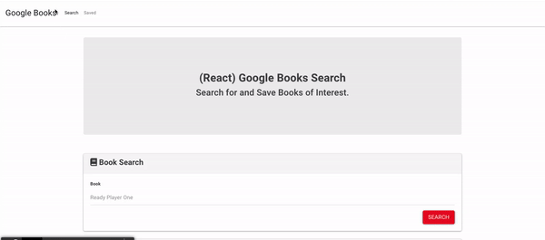

# Google Book Search
  
## Description
This app will allow to search for any books available on Google Books. The user will be able to not only view the book for purchase, but also save their favorite accordingly. If the user decides to delete any favorite books, a delete button is made available to them. Get reading!
## Table of Contents 
- [Installation](#installation)
- [Usage](#usage)
- [Technologies](#technologies)
- [License](#license)
- [Contributors](#contributors)
- [Testing](#test)
- [Questions](#questions)
## Installation
1) Install React 
2) Install the following dependencies: 
    a) Axios 
    b) Express 
    c) if-env 
    d) Mongoose or 
3) Copy the package.json contents on my github, and then perform an npm i on your terminal, or console, and all packages will be installed automatically.
## Usage
-  
- [Click](https://mysterious-meadow-63767.herokuapp.com/) to interact with the live app. 
## License
This application is under the MIT license.  
## Technologies
- React
- useState
- useEffect
- Scss
- Jsx
- Express
- Axios
- Mongoose
## Contributors
N.A..
## Testing
This application was tested using This app was tested using Insomnia, and local browser
## Questions
For more information, please visit [GitHub Profile](https://github.com/agonzalvez/).  
For any questions, you may email me at agonzalvez1@gmail.com.